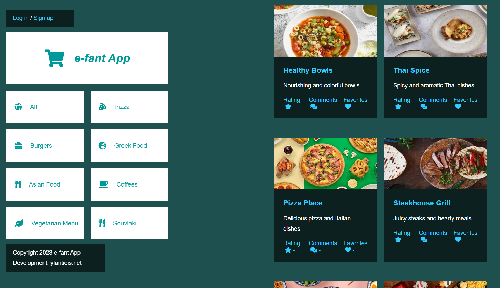
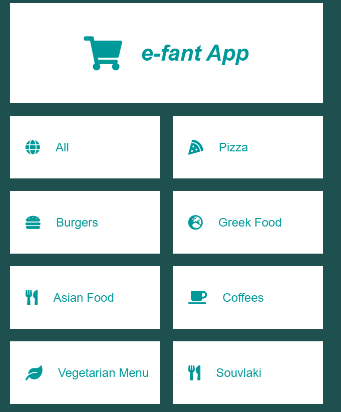
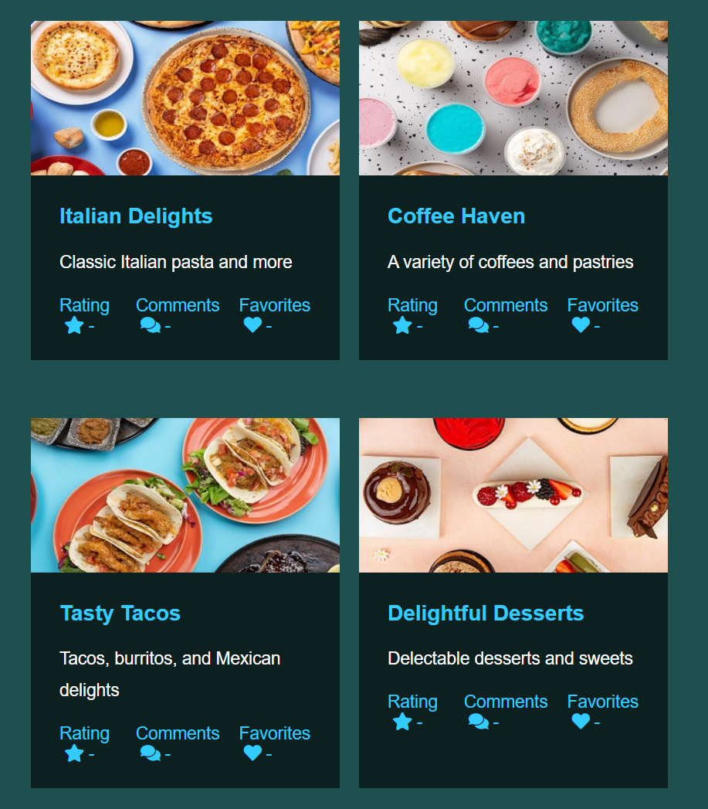
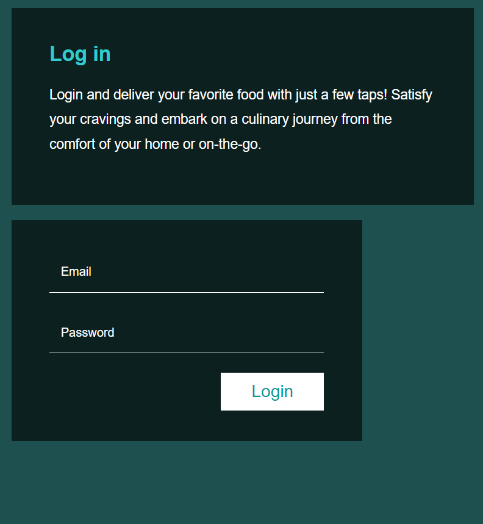
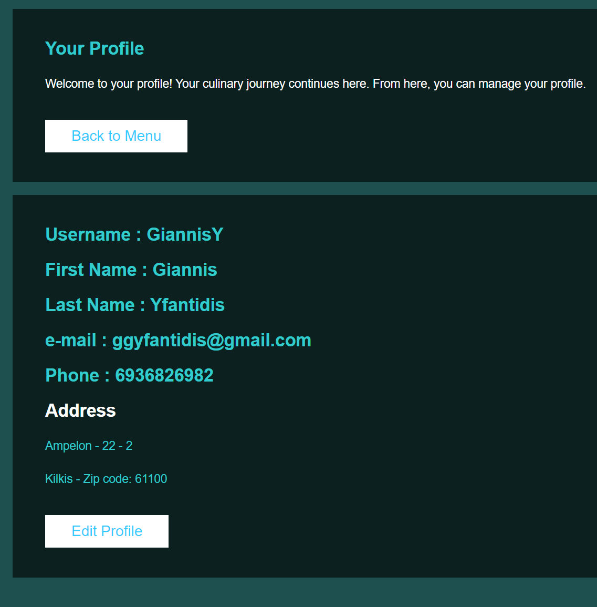
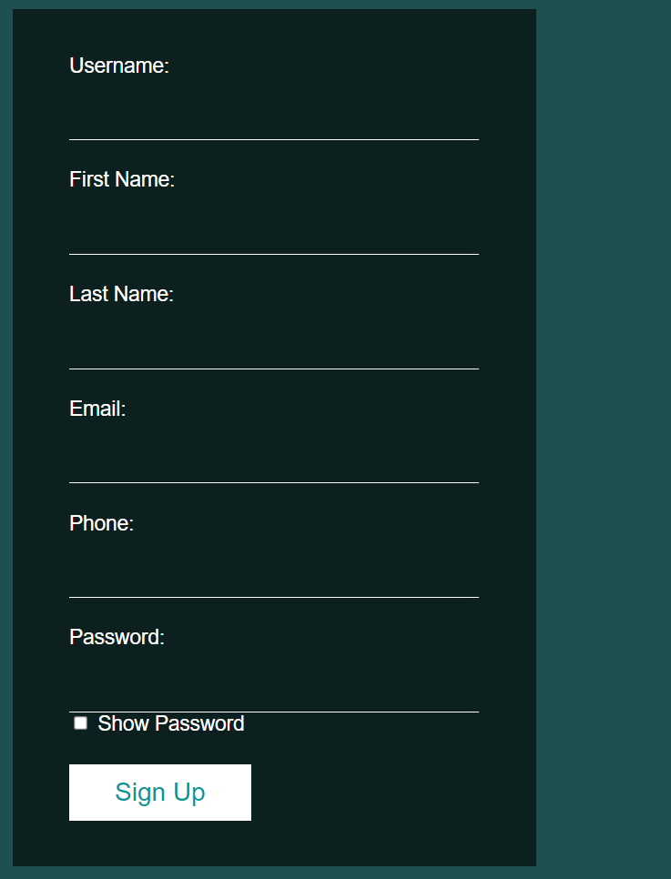
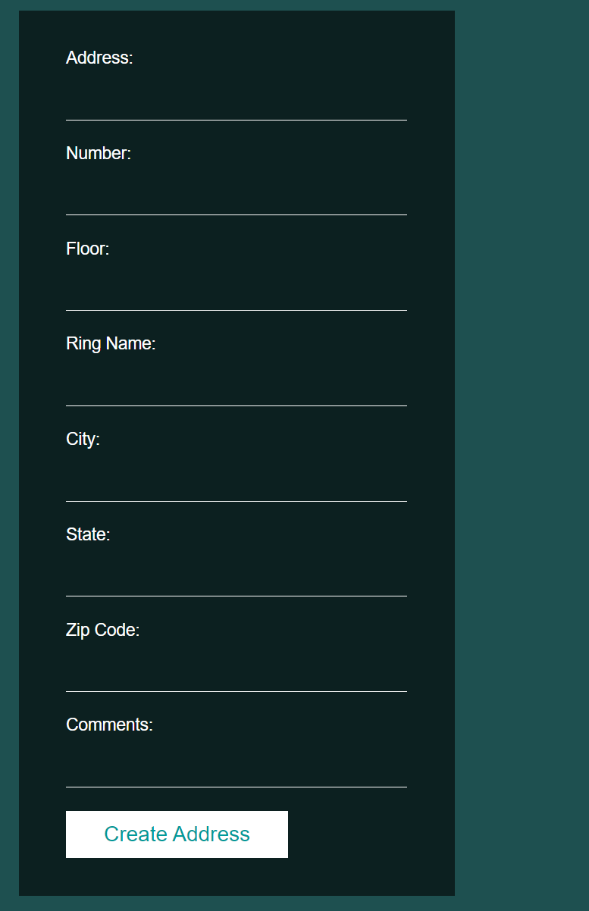
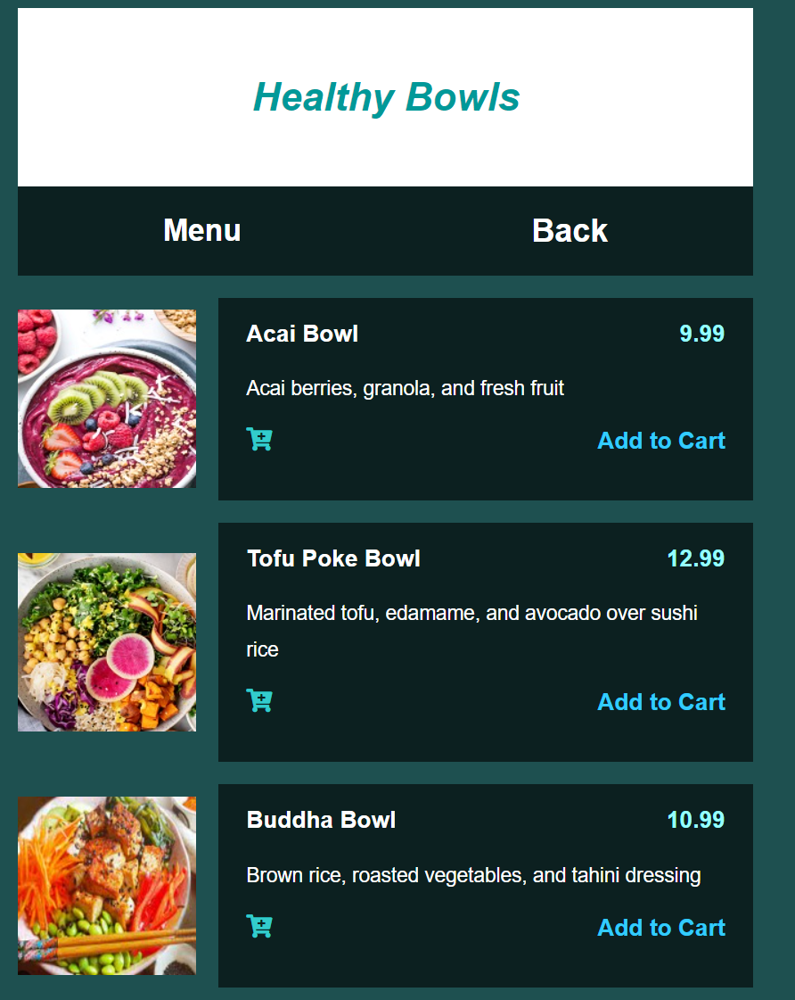
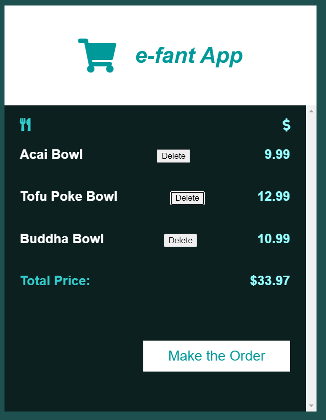
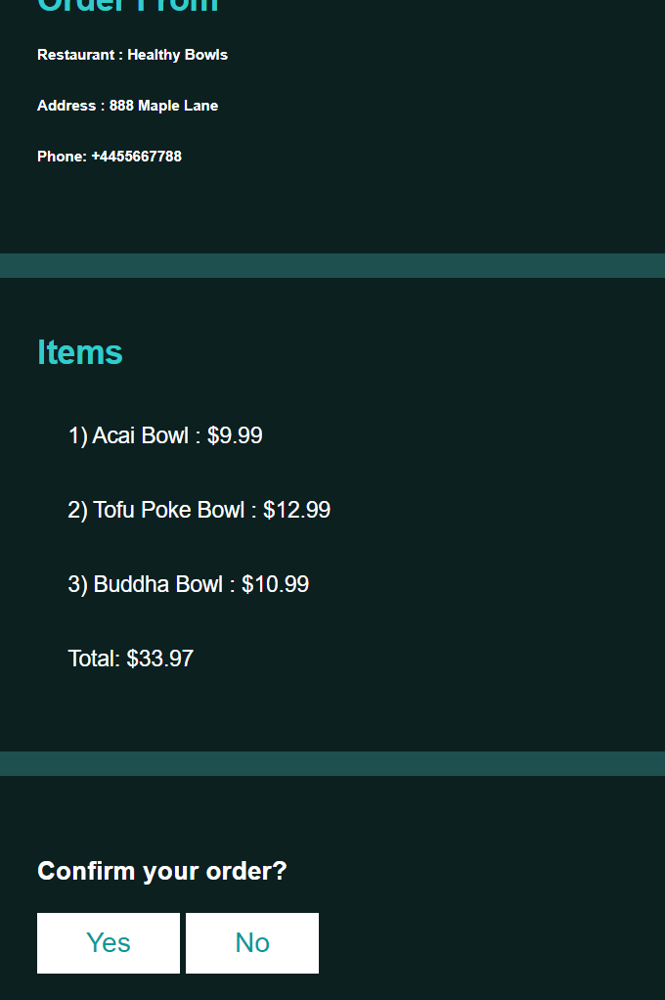

# E-Fant App

Welcome to the E-Fant app repository! This project utilizes React, Spring Boot, and PostgreSQL to create an online food delivery platform. Users can browse restaurants, view items, and place orders.

## Features

- Browse restaurants and their items
- User authentication and signup
- Place and manage orders

## Technologies Used

### Frontend
- React: Frontend UI framework
- HTML: HyperText Markup Language for webpage structure
- CSS: Cascading Style Sheets for styling

### Backend
- Spring Boot: Backend Java framework
- Java: Programming language for backend development
- Maven: Dependency management and build tool

### Database
- PostgreSQL: Relational database management system

  

## Getting Started

### Prerequisites
Before running the application, ensure that you have the following software installed:
- npm
- Node.js: It can be installed via terminal via the command: `npm install node.js`
- postgreSQL

### Usage
To run the application, follow these steps:
- Open a new terminal.
- Navigate to: `cd restapi`
- Run the command: `mvn spring-boot:run`

  
1. Set up the database locally: 
    - Navigate to path:`database/src/main/resources`
    - Run the migrations in PostgreSQL console: `V1__efant_db_schema.sql`
    - 
    - 2. Start the backend server:
   Run ReastApiApplication  

3. Start the frontend development server:
    - Open a new terminal.
    - Navigate to: `cd e-fant-frontend`
    - Run the command: `npm start`

3. Access the application in your web browser at: `http://localhost:3000`

1. Clone the repository:

git clone https://github.com/gyfantidis/e-fant.git

## API Documentation Example
The API's provides the following endpoints:

API Documentation

## JSON Responses

The Json's responses

## Screenshots

\
Home Page

\
Restaurant categories

\
Restaurants 

\
Log in Page

\
Users profile Page

\
Sign up Page

\
Create new user's address Page

\
Restaurants Item

\
Orders List

\
Final List and confirm order

